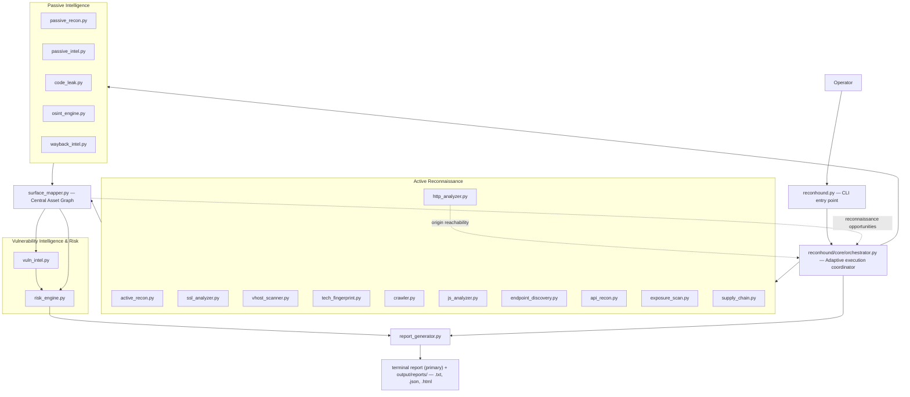

# ReconHound

**A modular Python reconnaissance framework that turns fragmented recon output into one correlated, evidence-driven attack-surface model.**


> Authorized reconnaissance only. ReconHound performs no exploitation, no credential attacks, and no persistence — see [Security Boundary](#security-boundary).

---

## Table of Contents

- [What Is ReconHound?](#what-is-reconhound)
- [Why It Exists](#why-it-exists)
- [Core Differentiators](#core-differentiators)
- [Architecture](#architecture)
- [Execution Model](#execution-model)
- [Reachability-Aware Execution](#reachability-aware-execution)
- [Coverage Semantics](#coverage-semantics)
- [Module Reference](#module-reference)
- [Surface Mapper — The Correlation Layer](#surface-mapper--the-correlation-layer)
- [Risk Engine — Relationship-Based Prioritization](#risk-engine--relationship-based-prioritization)
- [Vulnerability Intelligence](#vulnerability-intelligence)
- [Security Hardening](#security-hardening)
- [Security Boundary](#security-boundary)
- [Operator Workflow](#operator-workflow)
- [Terminal Experience](#terminal-experience)
- [Installation](#installation)
- [Usage](#usage)
- [Outputs & Reporting](#outputs--reporting)
- [Performance](#performance)
- [Testing & Quality Assurance](#testing--quality-assurance)
- [Design Philosophy](#design-philosophy)
- [Current Limitations](#current-limitations)
- [Where It Goes Next](#where-it-goes-next)
- [Contributing](#contributing)
- [Security Reporting](#security-reporting)
- [License](#license)
- [Disclaimer](#disclaimer)

---

## What Is ReconHound?

ReconHound is a CLI reconnaissance framework for authorized attack-surface discovery. It is **not** a wrapper that runs a pile of scanners and concatenates their output. Its architectural value is the pipeline that sits between "a tool produced a result" and "an operator has something worth investigating":

```
DISCOVER → NORMALIZE → STORE EVIDENCE → UPDATE ASSET GRAPH → CORRELATE
→ IDENTIFY NEW ATTACK SURFACE → MAKE EXPLAINABLE DECISION → INVESTIGATE
→ DISCOVER AGAIN → PRIORITIZE → REPORT
```

Twenty-two modules feed observations into a central asset graph (`surface_mapper.py`), which deduplicates them, tracks evidence, provenance and confidence, preserves conflicting signals instead of discarding them, remembers what has already been checked, and exposes new reconnaissance opportunities that the orchestrator can act on automatically. A relationship-aware risk engine then turns that graph into a prioritized, explained investigation queue — not a flat list of alerts — which is rendered as a terminal-native report at the end of every run.

ReconHound is intended for **authorized penetration testing, bug bounty reconnaissance, assessment of infrastructure you own, lab environments, and security research conducted with permission**. It discovers and explains attack surface; it never exploits it.

## Why It Exists

Running `subfinder`, `nmap`, `httpx`, `gau`, and a dozen other tools by hand produces a pile of disconnected text files. Nothing tells you that the subdomain one tool found is the same host another fingerprinted, or that a JS file the crawler pulled down references an API endpoint that also showed up in Wayback history. Nothing remembers that a check already ran and found nothing. Nothing tells you that half your "clean" results came from an origin that never answered a single request. Correlating that by hand doesn't scale past a handful of hosts.

```
Tool A ──┐
Tool B ──┤
Tool C ──┤──▶ Separate, uncorrelated output files
Tool D ──┤
Tool E ──┘
```

ReconHound runs the same category of checks, but every result flows through one graph, carrying its evidence and its uncertainty with it.

## Core Differentiators

| Concept | What it means in ReconHound |
|---|---|
| **Correlation** | Independent observations from different modules that describe the same underlying asset are merged, not duplicated. |
| **Evidence & provenance** | Every finding carries its evidence list, producing module, observation id, and timestamp — never just a bare conclusion. |
| **Confidence** | Findings are LOW / MEDIUM / HIGH, not binary. Converging independent signals raise confidence; a single weak signal stays LOW, and a downstream database hit can never erase upstream uncertainty. |
| **Negative-result memory** | Completed checks are remembered per (asset, check) across four states so they are not repeated unnecessarily — and are only recorded when the check was genuinely conclusive. |
| **Conflict preservation** | When observations disagree, both are preserved and surfaced — never silently overwritten. A disagreement between two modules and the same module seeing a changed value later are classified differently, because they mean different things. |
| **Adaptive discovery** | New discoveries (a cert SAN, a JS-referenced API route, a newly found virtual host) can trigger the orchestrator to schedule relevant follow-up work automatically, within a bounded budget. |
| **Reachability awareness** | An origin proven unreachable is not enumerated by five downstream modules with full wordlists. The run skips that work and records why. |
| **Honest coverage** | An origin that answers no request is reported as unreachable, not as "nothing found": the run is not called complete coverage, and the report names the origins nothing was checked on. |
| **Prioritization** | The operator gets a ranked, explained investigation queue, not an undifferentiated data dump. |
| **Determinism** | Given the same graph, the assessment and the report are reproducible: sorted iteration, content-hash identifiers, no wall-clock inputs to scoring. |
| **Modular architecture** | Each of the 22 modules is independently importable, has its own `python -m` entry point, and is covered by its own test file. No reconnaissance or intelligence module imports another — only the orchestrator, the report generator and the CLI import siblings, and only to coordinate them or to reuse their vocabulary. |
| **Human-in-the-loop** | ReconHound assists judgment — it does not replace manual validation or exploitation decisions. |

## Architecture



### What each layer is responsible for

**CLI (`reconhound.py`).** The operator's interface and nothing more. It parses and validates arguments, renders the banner and live progress, starts the orchestrator, prints the run summary and the terminal report, lists the artifacts that were actually written, and chooses the exit code. It owns no reconnaissance logic and makes no network requests of its own.

**Orchestrator (`reconhound/core/orchestrator.py`).** The central execution coordinator. It resolves which modules run for the requested mode, sequences them in dependency order across phases, derives each module's subjects from the correlated graph, enforces per-subject work budgets, records origin reachability and skips downstream enumeration that cannot succeed, registers every invocation under an execution identity so the same work is never repeated in one run, consumes the mapper's reconnaissance opportunities for adaptive follow-up, coordinates graph persistence, isolates per-module failures, and writes an execution record with a justification (`[REASON: ...]`) for every significant decision. It does **not** replace the individual scanners, and it does not do the correlation itself.

**Reconnaissance modules.** Passive modules gather intelligence without touching the target; active modules interact with it directly. Each is a self-contained unit with its own scope gate, its own request bounds, its own error handling, and its own crash-safe persistence. Each writes structured findings — `{type, target, value, evidence, confidence, source, timestamp, metadata}` — and nothing else.

**Surface Mapper (`surface_mapper.py`).** The central correlation layer and the architectural brain. See [its own section below](#surface-mapper--the-correlation-layer).

**Risk Engine (`risk_engine.py`).** Consumes the correlated graph and produces a prioritized, explained investigation queue. It performs no scanning, probing, or exploitation of any kind.

**Report Generator (`report_generator.py`).** Builds one report document from the graph, the assessment and the execution record, and renders it terminal-first. It computes no severity or confidence of its own.

`surface_mapper.py` is not a pipeline stage that runs once — it ingests output after **every** module invocation, so a crash at any point leaves behind a fully correlated graph of everything discovered up to that moment.

## Execution Model

| Phase | Purpose | Input | Output |
|---|---|---|---|
| **Passive intelligence** | Gather intel without touching the target directly (DNS, WHOIS, TLS certificate data, public repos, OSINT, historical web archives, external intel databases). | Target domain | Observations → asset graph |
| **Active network recon** | Port/service discovery, TLS analysis, virtual-host discovery against in-scope IPs. | In-scope IPs and hostnames from the graph | Observations → asset graph |
| **Active web recon** | HTTP posture, technology fingerprinting, crawling, JS analysis, endpoint/API enumeration, exposure checks, third-party mapping. | In-scope web origins from the graph | Observations → asset graph |
| **Vulnerability intelligence & risk** | Map fingerprinted technology versions to public CVE records, then score the correlated graph by relationship rather than by isolated finding. | Correlated asset graph | Investigation queue with explanations |
| **Adaptive round** | Act on the reconnaissance opportunities the mapper raised during the run, in priority order, within a bounded action budget. | Pending opportunities | Further observations → asset graph |
| **Reporting** | Render the graph, assessment and execution record as an operator-readable and machine-readable report. | Graph + assessment + execution record | Terminal report + `.txt`, `.json`, `.html` |

Module order inside a phase is a dependency order, not a preference: `tech_fingerprint` feeds `endpoint_discovery`'s wordlist selection, `crawler` feeds `js_analyzer`'s file list and `supply_chain`'s page list, and `js_analyzer` feeds `endpoint_discovery`'s JS-derived parameter correlation.

Work is bounded at every level. Per-run budgets cap how many IPs are scanned, how many web targets, SSL targets, virtual-host IPs, JavaScript files, supply-chain pages and adaptive actions a single run will spend itself on. When a budget truncates work, the omission is recorded in the run's `coverage` block rather than silently swallowed.

## Reachability-Aware Execution

A web origin that accepts a TCP connection but never completes an HTTP request is the most expensive thing a reconnaissance framework can meet: every wordlist entry costs a full timeout, and the result is zero observations. ReconHound handles this at two layers.

**Layer 1 — orchestrator-level.** `http_analyzer.py` is the first module of the web phase and the only module that reports origin reachability as a first-class outcome. When it reports an origin as unreachable, the orchestrator records that fact against the origin (scheme + host + port, never merely the host) and skips the five modules that would otherwise enumerate it:

- `tech_fingerprint`
- `crawler`
- `endpoint_discovery`
- `api_recon`
- `exposure_scan`

Each skip is recorded with its reason in the decision queue and surfaced in the run's coverage block. Reachability is never demoted: an origin that answered even once is treated as reachable for the rest of the run.

**Layer 2 — module-level tripwire.** `endpoint_discovery.py`, `api_recon.py` and `exposure_scan.py` each carry their own consecutive-transport-failure tripwire, so a standalone or `--module` run gets the same protection without the orchestrator. The tripwire arms only while nothing in the run has ever been answered, and a single answered probe disarms it permanently.

Crucially, a tripped run is deliberately left **inconclusive**: no `*_checked_no_*` negative result is written into shared memory, so a later run against a healthy origin repeats the work in full. Skipping work must never be mistaken for having done it.

> **"Unreachable" is not "checked and nothing found."** They are opposite statements about coverage, and ReconHound keeps them distinct everywhere: in module status vocabularies, in the orchestrator's execution record, in the CLI's status labels, and in the report.

## Coverage Semantics

ReconHound does not report complete coverage it did not achieve. A run's execution record carries an explicit coverage block, and the report renders it:

- **Reachable** — the origin answered, and the modules that depend on it ran.
- **Unreachable** — the origin answered nothing. Enumeration was skipped rather than spent on transport failures, and the origins are named. The report states plainly that nothing in it describes them, and that this is absence of coverage, not absence of evidence.
- **Checked, not found** — a conclusive negative result. Recorded in the mapper's negative-result memory with the four check states `not checked` / `checked and not found` / `found` / `found with uncertainty`, and reported in its own section.
- **Skipped, with a reason** — every skipped or scope-rejected execution carries a recorded justification.
- **Incomplete coverage** — a run is only reported as complete when no budget truncated work *and* no origin was unreachable. Anything else is a stated limitation in the report, not a silent gap.

Where an input to the report (graph, assessment, or execution record) is missing or a section could not be built, the report says so explicitly rather than rendering an empty or zeroed-out section.

## Module Reference

All 22 architectural modules are implemented in the repository. Each is independently importable, has its own `python -m` entry point for standalone use, and is covered by its own test file under `tests/`.

> `screenshot.py` was **removed** during the audit cycle (see `context.md` §18.1). ReconHound performs no browser screenshot capture and no screenshot-based reporting. Genuine headless-browser reconnaissance remains a future capability, not a current one.

| Module | Phase | Purpose | Intelligence produced |
|---|---|---|---|
| `passive_recon.py` | Passive | Initial infrastructure intel | DNS records (A/AAAA/CNAME/MX/TXT/NS/SOA), WHOIS, TLS certificate + SAN bootstrap, ASN/IP-range data, email security posture (SPF/DMARC/DKIM) |
| `passive_intel.py` | Passive | External intel databases | Shodan / Censys host, port, banner and certificate data, without touching the target (requires API credentials) |
| `code_leak.py` | Passive | Public repository intel | Exposed keys/tokens, internal URLs, config files and DB connection strings found via GitHub code search, redacted before persistence |
| `osint_engine.py` | Passive | OSINT / digital footprint | Harvested emails, inferred naming conventions, HIBP breach correlation, DNS history, reverse-IP and ASN-neighbour intel — inferred data is explicitly marked as inferred |
| `wayback_intel.py` | Passive | Historical web intel | Historical URLs, removed paths, old endpoints and parameters from the Wayback Machine, diffed against the current surface |
| `active_recon.py` | Active — network | Network-level recon | TCP/UDP port scans, IPv6 scanning, banner grabs, protocol-specific enumeration (SMTP/SNMP/FTP/SSH/IPMI/DB), TTL-based OS hints, cross-host port-pattern detection |
| `ssl_analyzer.py` | Active — network | TLS/certificate intelligence | Certificate validity and expiry, TLS version (flagging 1.0/1.1), cipher suites, hostname validation, chain analysis, self-signed detection, SAN extraction fed back to the graph |
| `vhost_scanner.py` | Active — network | Virtual-host discovery | Host-header-based discovery of applications on already-discovered IPs that DNS does not reveal |
| `http_analyzer.py` | Active — web | HTTP security posture **and origin reachability** | Security headers, cookie flags, CORS behaviour, auth surfaces, JWT structure (no exploitation), cache intelligence, host-header behaviour, redirect chains, WAF signals — and the authoritative reachable/unreachable verdict per origin |
| `tech_fingerprint.py` | Active — web | Technology identification | CMS / framework / server / WAF detection from headers, cookies, HTML, JS, paths and favicon hashes, each with evidence and confidence |
| `crawler.py` | Active — web | In-scope web crawling | URLs, forms classified by purpose, parameters, JS references, WebSocket and GraphQL indicators, high-priority flags for file-upload surfaces |
| `js_analyzer.py` | Active — web | Client-side JS intelligence | API routes and internal endpoints extracted from JavaScript, route templates, source-map detection and original-source reconstruction, config values, secret indicators flagged for manual verification only |
| `endpoint_discovery.py` | Active — web | Web/API endpoint enumeration | Directory/file enumeration with tech-aware wordlists, API endpoint discovery, full parameter inventory, historical and JS parameter correlation, recursive discovery |
| `api_recon.py` | Active — web | Dedicated API recon | API version discovery, OpenAPI/Swagger discovery and parsing, GraphQL detection and bounded authorized introspection, REST/GraphQL/gRPC classification, documentation discovery, deprecated-endpoint and HTTP-method discovery, auth-method fingerprinting |
| `exposure_scan.py` | Active — web | Sensitive exposure detection | Exposed `.git`/`.env`/backups/archives/config, debug pages, admin panels, `robots.txt`/`sitemap.xml`, cloud storage misconfiguration, verbose error-page intelligence, per-endpoint OPTIONS discovery |
| `supply_chain.py` | Active — web | Third-party supply-chain mapping | External JS/CDN/analytics inventory, CSP analysis, subdomain-to-third-party DNS relationships, provider categorization (payment/analytics/CDN/auth), third-party trust map |
| `vuln_intel.py` | Intelligence | Technology-to-CVE mapping | Possible CVE matches for observed versions from NVD, OSV, GitHub Security Advisories, CISA KEV, Exploit-DB and FIRST EPSS — labelled as intelligence, never as confirmed exploitability |
| `risk_engine.py` | Intelligence | Relationship-based prioritization | A CRITICAL/HIGH/MEDIUM/LOW/INFO investigation queue, with an explicit rationale per score |
| `surface_mapper.py` | Continuous | Central asset graph & correlation | The correlated attack-surface state: assets, relationships, evidence, provenance, confidence, conflicts, negative results, discovery state, attack-surface paths and reconnaissance opportunities |
| `report_generator.py` | Output | Terminal-first reporting | The terminal report printed after every run, plus `.txt`, `.json` (schema 1.1) and a secondary `.html` artifact, all rendered from one hardened document |
| `core/orchestrator.py` | Core | Adaptive execution coordination | Phase sequencing, subject derivation, budgets, execution identity, reachability decisions, adaptive rounds, failure isolation, the decision queue and the execution record |
| `reconhound.py` | Entry point | CLI | Argument parsing and validation, banner, live progress, run summary, terminal report, artifact table, exit-code selection |

## Surface Mapper — The Correlation Layer

`surface_mapper.py` is ReconHound's central intelligence layer and the architectural brain of the system — not an afterthought bolted on at the end of the pipeline.

> Recon modules discover observations. Surface Mapper turns those observations into a coherent, continuously updated attack-surface model.

It consumes every module's structured finding records and turns them into:

```
Observation → Evidence → Asset / Relationship → Confidence → State
  → Reconnaissance Opportunity
```

Responsibilities implemented here:

- **Asset identity and normalization** — outputs from every module are normalized into one asset schema, and independent discoveries describing the same underlying asset are merged rather than duplicated. Asset identity is stable across re-scans: values that legitimately change between runs belong to observation metadata, not to an asset's identity.
- **The unified asset graph** — organization → domain → subdomain → IP → port/service → technology → URL → endpoint → parameter → JavaScript → API → finding, plus DNS, WHOIS, ASN, TLS/SAN, Wayback, virtual-host and third-party relationship data.
- **Evidence and provenance storage** for every asset, relationship and observation — which module said it, when, and on what basis.
- **Observations over time** — every ingestion is retained as an observation record, so an asset's history is inspectable rather than overwritten.
- **Confidence tracking** (LOW / MEDIUM / HIGH) per finding, with ceilings that survive merging so a derived attribute can never be counted as an independent corroborating source.
- **Conflict detection and preservation** — contradictory observations are kept and surfaced, never silently resolved by picking one. Each conflict is classified as `cross_source` (two different modules disagree — the genuine contradiction, which holds a version-dependent CVE assessment back until it is resolved) or `temporal` (the same module observed a different value later — a rotated DNS answer, a bumped SOA serial, an upgraded server, which is a change in the target rather than a disagreement between modules, and must not suspend downstream assessment).
- **Negative-result memory** across four check states — `not checked` / `checked and not found` / `found` / `found with uncertainty` — so expensive checks are not repeated needlessly, and so that only a genuinely conclusive check is ever recorded as a negative.
- **Scope enforcement** — reconnaissance opportunities are never emitted for assets outside the authorized target scope, and names that the repository's own host validators would reject are kept as labelled evidence rather than minted as phantom assets.
- **Discovery state tracking** (discovered / queued / investigated / completed / failed) and **attack-surface path construction** showing how each asset was reached.
- **Crash-safe, idempotent graph persistence** to `<output_dir>/surface_graph.json` — every write goes to a temporary file, is fsynced and then renamed into place, so an interrupted run never leaves a torn graph. Observation identities are content hashes, so re-ingesting the same finding twice is a no-op.
- **Exposing reconnaissance opportunities** — the adaptive investigation queue the orchestrator consumes: new hostnames from certificate SANs, newly opened ports, newly discovered virtual hosts, technology-specific enumeration, JS-referenced endpoints awaiting verification, file-upload surfaces, and subdomain-takeover indicators flagged for manual verification.

Surface Mapper is explicitly **not** a vulnerability scanner and does not exploit anything it correlates.

## Risk Engine — Relationship-Based Prioritization

`risk_engine.py` evaluates evidence other modules already produced. It never scans, probes, or executes anything itself. Its pipeline runs in five stages:

```
Ingestion → Signal Extraction → Classification → Correlation → Prioritization / Output
```

- **Ingestion** — reads the correlated asset graph (`surface_graph.json`, or a live in-memory graph) and its relationships.
- **Signal extraction** — normalizes graph content into discrete risk signals, each tagged with its kind: a plain observation, an explicitly unverified indicator, vulnerability intelligence, or a condition the producing module directly observed.
- **Classification** — scores each signal CRITICAL / HIGH / MEDIUM / LOW / INFO.
- **Correlation** — several converging signals on one asset (missing HSTS + a self-signed certificate + outdated TLS, say) can combine into a higher severity than any one alone would justify. Convergence counts *distinct weakness categories*, never repetitions of the same one, and every escalation is bounded by the confidence of the evidence that justified it.
- **Prioritization / output** — a ranked investigation queue in which every entry carries a `rationale` explaining *why* it was scored the way it was.

Two attribution rules matter and are enforced:

- **Roll-up follows containment, not adjacency.** A finding is attributed upward only along containment relationships. Identity and reference links — a shared certificate, a CNAME alias, a script reference — are never a path for attribution, so one host's exposure is never blamed on every host that merely shares a certificate with it. IP-to-hostname fan-out is bounded, and any suppression is recorded on the signal.
- **A mapper-derived attribute is not an independent source.** Signals carry a confidence ceiling that survives merging, so the same fact seen twice in two representations cannot inflate its own confidence.

> **Severity is a prioritization assessment of where to look first — never proof of exploitability.**

## Vulnerability Intelligence

`vuln_intel.py` consumes technology and version observations already in the graph and queries public vulnerability data. The sources actually implemented are:

| Source | What it contributes |
|---|---|
| **NVD** | Keyword-searched CVE records, with each result's CPE configuration data inspected locally for version-range applicability. Self-rate-limited to NVD's documented public limits; `NVD_API_KEY` raises them. |
| **OSV** | Package-ecosystem queries with provider-side version filtering. No ecosystem is ever guessed — when none can be inferred, OSV is reported as skipped with an explicit reason. |
| **GitHub Security Advisories (GHSA)** | Advisories carrying a GitHub-assigned CVE id, with the GHSA id, ecosystem, package and first patched version preserved. GHSA-only advisories are counted, never silently dropped. |
| **CISA KEV** | Whether CISA has evidence the CVE has been exploited in the wild against *some* target — real intelligence, explicitly not target-specific confirmation. |
| **Exploit-DB** | Whether a public proof-of-concept exists for the CVE, via the public exploit index. Presence means a PoC exists somewhere, not that it works against this asset. |
| **FIRST EPSS** | An exploitation-*likelihood* score for the CVE. Carried as prioritization context only; it is never treated as evidence about this target and never as a severity step. |

**What ReconHound claims, and what it never claims.** ReconHound provides vulnerability *intelligence*: matching, applicability assessment and prioritization. It does **not** claim confirmed exploitation merely because a CVE exists, a product or version appears affected, an exploit reference exists, a KEV entry exists, or any intelligence source matched. Output reads "Detected Nginx 1.18.0 — **may** be affected by CVE-XXXX," and the invariant is stated in the module itself:

```
DETECTION / INTELLIGENCE ≠ CONFIRMED VULNERABILITY ≠ CONFIRMED EXPLOITATION
```

**Attribution and version evidence matter.** Every match is tagged with an explicit applicability:

- `version_range_confirmed` — an authoritative source's own range data places the observed version inside the documented vulnerable range.
- `keyword_match_version_unconfirmed` — the product name matched, but no source's range data could confirm or deny the specific version.
- `version_unknown_cannot_confirm` — no version was observed at all; the match is a bare product-name reference.

Match quality is recorded alongside it (exact CPE product, curated alias, merely related name, or a package query), and a merely *related* product name can never produce a range-confirmed result. Final confidence is the **minimum** of four independent dimensions — the upstream detection's own confidence, the mapping quality, source agreement, and applicability evidence — so an exact-looking database hit can never turn a LOW-confidence fingerprint into a HIGH-confidence statement about the target. Distribution/vendor revision markers in a version string (backported security fixes) cap mapping confidence and set an explicit uncertainty flag.

**Provider outage is not authoritative absence.** Every provider returns an explicit outcome, and only conclusive outcomes count. A "checked, no match" negative result is persisted only when every CVE-discovery source that ran was conclusive — a rate-limited or failing provider leaves the result inconclusive rather than producing a false clean bill of health. KEV, Exploit-DB and EPSS are annotation sources and are excluded from that computation entirely, and each carries a checked-vs-unknown distinction: an unavailable KEV feed reads as "not checked", never as "not listed", and an unavailable EPSS score is null with a reason, never `0.0`.

## Security Hardening

Every module treats target-controlled and provider-controlled data as hostile input. The protections below are implemented in the current code.

**Scan-target and SSRF-style protections**

- **Redirect and discovered-link destinations are scope-gated.** A server can point `Location:` anywhere; following one unconditionally would let an in-scope host steer the scanner at third parties or at internal addresses. A host read out of a redirect, a crawled link, a JS reference or a page's third-party resources is accepted only if it is in scope, and an IP literal from such a source is accepted only when it *is* the target.
- **Special-use IP destinations are refused as scan subjects.** A DNS answer is target-controlled data: an in-scope hostname whose A record names a loopback, link-local (including `169.254.169.254`, the cloud instance-metadata service of the machine running ReconHound), unspecified, `0.0.0.0/8`, multicast, reserved or broadcast address does not point at the target, and is never handed to an active module. Every exclusion is reported under the run's scope block. IPv4-mapped IPv6 forms are covered.
- **RFC1918 and CGNAT addresses are deliberately *not* blocked as scan targets.** An internal engagement against a host that resolves to `10.0.0.5` is exactly the reconnaissance this tool exists for, and refusing it would remove real capability. The scan-subject gate is narrow by design: only addresses that cannot denote a remote target at all are excluded. (Private and reserved addresses *are* refused as redirect/discovered-link destinations, where the choice was the server's rather than the operator's.)
- **Strict scope enforcement throughout.** Hostnames are IDNA-normalized before comparison, scope is a suffix match against the authorized target, and names that the repository's own host validators would reject — wildcards, single labels, over-long labels, embedded whitespace — are kept as labelled evidence rather than emitted as hostname discoveries that would become phantom assets and guaranteed scope-rejected scans.
- **Malformed target input is rejected at the CLI**, with a usage exit code — including non-finite tuning values such as `--timeout nan`/`inf`, which sockets would otherwise turn into a run where every module fails for a reason that looks like a network problem.

**Credential hygiene**

- **`user:password@` is stripped from every URL** before it is re-sent, before it becomes part of an asset identity, and above all before it is written to `pending_assets.json`, the decision queue or the execution record.
- **Credential-shaped material is redacted** at the point it enters the report data model and again before anything target-derived is printed: API keys, tokens, JWTs, `password=` assignments and private-key blocks are masked. Producing modules redact what they recognize; the report layer is defence in depth for what they did not. This is best-effort against recognizable shapes, never a guarantee — and the report says so.
- **Error text is redacted before persistence**, so a provider URL carrying `?key=` never reaches an artifact.

**Terminal and report safety**

- **Terminal escape/control-sequence injection is neutralized.** Every escape sequence a terminal could act on begins with a control character, so every control character in target-derived text is replaced by its printable `\xNN` form — defeating OSC 8 hyperlinks, OSC 52 clipboard writes, CSI cursor and colour manipulation, DCS/APC/PM/SOS strings and NUL truncation — while keeping visible to the operator that the target sent them.
- **Hostile Unicode is handled the same way.** Bidi overrides, zero-width characters and other invisible format characters become visible escapes; lone surrogates are handled rather than crashing the writer.
- **Nothing target-derived is parsed as markup.** The CLI console and the report renderer both disable markup, emoji and highlighting, so an unmatched `[/bold]` in a crawled URL cannot raise a rendering error mid-run or forge a badge.
- **Wrapped lines never start at column 0**, so a long target-controlled string cannot pose as a new finding heading.
- **The HTML artifact escapes every rendered value**, loads no external resources or scripts, and carries a restrictive `Content-Security-Policy` meta tag.

**Bounded processing and persistence**

- **Response bodies are read under a byte cap** in every module that fetches target-served or feed content — the web modules, `wayback_intel.py` and `vuln_intel.py` (whose multi-megabyte KEV and Exploit-DB feeds have their own, larger caps). The credentialed JSON-API clients (`passive_intel.py`, `code_leak.py`, `osint_engine.py`) parse their provider's JSON response directly and bound what they extract from it rather than the transfer itself.
- **Every persisted collection is capped** with an explicit truncation marker, so a capped list never reads as a complete one.
- **Every string and container in the report document is bounded** with a visible in-band marker, and every section that hits a bound states what it is showing out of what.
- **Per-run bookkeeping lists are capped**, so a hostile graph cannot make the execution record grow without bound.
- **Poisoned (non-dict) graph records are handled**, not crashed on, wherever the orchestrator or the report reads the graph.
- **Persistence is atomic and crash-safe**: every artifact is written to a temporary file, fsynced and renamed into place — with a directory fsync in the module persistence stores — so an interrupted or killed run leaves no torn files.

None of this is a claim of formal security certification or of freedom from bugs. It is the set of protections the audits established and pinned with regression tests.

## Security Boundary

**ReconHound is:**
- Reconnaissance and attack-surface discovery
- Passive and active intelligence collection
- Cross-source correlation and evidence preservation
- Risk prioritization and investigation support

**ReconHound is not:**
- An exploitation framework
- A credential-attack or brute-force framework
- A privilege-escalation or persistence framework
- A replacement for manual security testing and human judgment

Intended use is **authorized penetration testing, authorized bug bounty work, infrastructure you own, lab environments, and security research conducted with permission**.

> **Authorized use only.** ReconHound performs active network interaction with the target you specify. Only run it against systems you own or have explicit, documented authorization to test. Do not point it at third-party infrastructure without authorization. The operator is solely responsible for legal and ethical use.

## Operator Workflow

```
Authorized Target
       │
       ▼
   ReconHound
       │
       ▼
Attack-Surface Discovery  (passive + active recon)
       │
       ▼
Evidence + Relationships  (surface_mapper.py)
       │
       ▼
Risk Prioritization  (risk_engine.py)
       │
       ▼
Terminal Report  (read where the run happened)
       │
       ▼
Manual Validation  (operator reviews the investigation queue)
       │
       ▼
Deeper Security Testing  (outside ReconHound's scope)
```

ReconHound hands the operator a prioritized, evidence-backed starting point. It does not decide what is exploitable, and it does not perform the deeper testing itself.

## Terminal Experience

The CLI (`reconhound.py`) is built on [Rich](https://github.com/Textualize/rich) and renders:

- An ASCII banner with version, tagline, and the "authorized reconnaissance only" subtitle.
- An **Execution** panel showing the resolved target, mode, selected modules, output directory, and effective threads/timeout/min-severity settings before any network activity starts.
- Live per-module progress (phase headings, module → subject, and a completion glyph/status per module run) via a transient spinner.
- A **Run result** panel (status, elapsed time, module execution counts).
- A **Module execution** table aggregating runs, observations ingested, time spent, and outcome per module — including the distinct `unreachable` outcome, shown as a warning because an unreachable subject is a hole in coverage, not a clean result.
- A **Warnings and failures** panel for any failed, unreachable or scope-rejected module runs.
- An **Attack surface** table (asset counts by type, plus totals for relationships, conflicts preserved, negative results, and pending opportunities).
- An **Adaptive discovery** panel summarizing follow-up actions fired and opportunities flagged for manual review.
- A **Decision queue** table (with `--verbose`) showing every significant orchestrator action and its recorded justification.
- The **terminal report** itself (see [Outputs & Reporting](#outputs--reporting)), which carries the severity distribution and the investigation queue. The CLI's own **Risk prioritization** panel is shown only as a fallback — when no report document could be built, or when `risk_engine` was skipped or failed — never alongside the report.
- An **Output artifacts** table listing every artifact actually written, with absolute paths and file sizes — an artifact that was not produced is labelled "not produced by this run," never omitted or faked.

Terminal output degrades gracefully: it falls back to ASCII glyphs on non-Unicode terminals, emits no escape sequences at all under `--no-color`, `NO_COLOR`, `TERM=dumb`, `CI=true` or when piped, shows a one-line wordmark instead of the banner on terminals narrower than it, and `--quiet` suppresses the banner and live progress while still printing the final summary and the terminal report. If the consumer of stdout goes away (`reconhound ... | head`), terminal output stops, one notice is written to stderr, the run finishes, its artifacts are still written, and the exit code still describes the run.

## Installation

**Requirements:** Python 3.10+ (developed and tested against 3.13), Linux (developed on Kali). No external binaries, browsers, or services are required — every module runs on the Python dependencies in `requirements.txt`.

```bash
git clone <repository-url>
cd ReconHound

python3 -m venv .venv
source .venv/bin/activate

pip install -r requirements.txt
```

`requirements.txt`:

```
dnspython>=2.6,<3
python-whois>=0.9,<1
cryptography>=42
requests>=2.31,<3
beautifulsoup4>=4.12,<5
rich>=13,<15
```

No package is installed system-wide; there is no `setup.py`/`pyproject.toml` console-script entry point yet. Run the CLI as a module from the repository root:

```bash
python3 -m reconhound.reconhound --target example.com --full-scan
```

### Optional API credentials

Several passive-intelligence modules enrich their results with third-party APIs and degrade gracefully — skipping that data source with an explicit reason rather than failing the run — when the corresponding credential is absent. **None of these is required for a scan to run.**

| Environment variable | Used by | Purpose |
|---|---|---|
| `SHODAN_API_KEY` | `passive_intel.py` | Shodan host/service/banner data |
| `CENSYS_API_ID` / `CENSYS_API_SECRET` | `passive_intel.py` | Censys host/service data |
| `GITHUB_TOKEN` | `code_leak.py`, `vuln_intel.py` | GitHub code search; higher GitHub Advisory rate limits |
| `GOOGLE_API_KEY` + `GOOGLE_CSE_ID` | `osint_engine.py` | Google Custom Search OSINT queries (both are required together) |
| `HIBP_API_KEY` | `osint_engine.py` | Have I Been Pwned breach correlation |
| `SECURITYTRAILS_API_KEY` | `osint_engine.py` | SecurityTrails DNS history |
| `HACKERTARGET_API_KEY` | `osint_engine.py` | HackerTarget reverse-IP intel |
| `NVD_API_KEY` | `vuln_intel.py` | Higher-rate NVD CVE lookups |

NVD, OSV, CISA KEV, Exploit-DB and FIRST EPSS all work without credentials.

## Usage

```bash
reconhound --target example.com --full-scan
```

(Substitute `python3 -m reconhound.reconhound` for `reconhound` if it is not installed on `PATH`.)

### Execution modes

```bash
reconhound --target example.com --full-scan             # passive + active + intelligence (default)
reconhound --target example.com --passive-only          # never touches the target directly
reconhound --target example.com --active-only           # active recon + intelligence modules
reconhound --target example.com --module js_analyzer    # run a single named module (repeatable)
```

`--passive-only` runs the five passive modules plus `vuln_intel` and `risk_engine` — both of which only query public databases or read the graph, and neither of which touches the target.

### Flags

| Flag | Effect |
|---|---|
| `-t, --target DOMAIN` | Authorized target domain (bare domain, not a URL or IP) — **required** |
| `-o, --output-dir DIR` | Directory for run state and artifacts (default: `output`) |
| `--full-scan` | Complete pipeline: passive, active and intelligence (default) |
| `--passive-only` | Passive and intelligence modules only; never touches the target |
| `--active-only` | Active reconnaissance and intelligence modules only |
| `-m, --module NAME` | Run only the named module; repeatable, and combinable with a mode flag |
| `--no-adaptive` | Do not act on the reconnaissance opportunities `surface_mapper` raises |
| `--threads N` | Worker threads inside each module (default: 10) |
| `--timeout SECONDS` | Per-request network timeout (default: 8.0) |
| `--wordlists-dir DIR` | Override the bundled `wordlists/` directory |
| `--min-severity LEVEL` | Lowest severity admitted to the investigation queue (default: `LOW`) |
| `--top N` | Investigation-queue entries shown in the terminal report (default: 10) |
| `-v, --verbose` | Show per-module detail, the decision queue, and every recorded error |
| `-q, --quiet` | Suppress the banner and live progress; print the final summary and report only |
| `--debug` | Print full tracebacks for unexpected failures |
| `--no-color` | Disable colour and styling (also honoured via `NO_COLOR`) |
| `-V, --version` | Print the version and exit |

`--full-scan`, `--passive-only` and `--active-only` are mutually exclusive, as are `--verbose` and `--quiet`. Full reference: `reconhound --help`.

### Examples

```bash
# Full pipeline against an authorized target, default settings
reconhound --target example.com --full-scan

# Passive-only recon — no active network interaction with the target
reconhound --target example.com --passive-only

# Run just the JS analyzer module standalone
reconhound --target example.com --module js_analyzer

# Custom output location, longer timeout, deeper queue in the report
reconhound --target example.com --output-dir /reports/example --timeout 30 --top 25

# Only CRITICAL/HIGH entries in the investigation queue
reconhound --target example.com --full-scan --min-severity HIGH

# Quiet, colourless output suitable for a CI log or a pipe
NO_COLOR=1 reconhound --target example.com --full-scan --quiet
```

### Interruption and terminal behaviour

- **Ctrl+C** is handled at every stage: `crawler`, `endpoint_discovery` and `api_recon` cancel their in-flight work and return their partial summary, the orchestrator records the interruption honestly (never as "nothing found" or "completed"), the graph and execution record are saved, artifacts are written, and the CLI exits `130`.
- **Colour** is used only when stdout is an interactive terminal. It is disabled by `--no-color`, by `NO_COLOR`, by `TERM=dumb`, and by `CI=true`; `FORCE_COLOR` overrides the TTY check (but never `NO_COLOR`), so colour can be forced into a pipe deliberately.
- **Non-TTY output** gets the same content in plain text — colour only decorates textual badges such as `[CRIT][HIGH CONF][CONFIRMED]`, so the report reads identically through a pipe, in a CI log, for a colour-blind operator, and in the `.txt` artifact.
- **Non-UTF-8 terminals** get the ASCII glyph set, and stdout is reconfigured so an unencodable character is escaped rather than crashing the run.

### Exit codes

| Code | Meaning |
|---|---|
| `0` | Run completed (discovering nothing is a normal outcome) |
| `1` | Run completed, but one or more modules or stages failed — or a report format could not be written |
| `2` | Invalid arguments, invalid target, or invalid configuration |
| `3` | Fatal error — the run could not start or aborted |
| `130` | Interrupted with Ctrl+C — everything discovered so far was preserved |

## Outputs & Reporting

Reporting is **terminal-first**. The primary analyst-facing report is rendered directly in the terminal at the end of every run, from the very document that was persisted to disk — so what the operator reads is exactly what automation gets. JSON and HTML are secondary artifacts.

Every run writes its state incrementally to `<output-dir>` (default `output/`):

| Artifact | File | Written by | Contains |
|---|---|---|---|
| Raw discoveries | `pending_assets.json` | Each producer module, immediately on discovery | Every structured finding, appended as it is discovered. Each write re-reads, appends and atomically rewrites the file, so a crash mid-write can never corrupt earlier discoveries and other modules' records are always preserved |
| Correlated asset graph | `surface_graph.json` | `surface_mapper.py` | Assets, relationships, observations, evidence, provenance, confidence, conflicts, negative-result memory, discovery state and pending reconnaissance opportunities |
| Risk assessment | `risk_assessment.json` | `risk_engine.py` | Every extracted risk signal with its severity, kind, confidence and rationale, plus the ranked investigation queue |
| Execution record + decision queue | `orchestrator_run.json` | `core/orchestrator.py` | Every module invocation and its outcome, the decision queue with a reason per action, budgets and coverage (including unreachable origins), scope exclusions, adaptive activity and errors |
| **Terminal report** | printed to stdout | `report_generator.py` | The primary human report (see below) |
| Text report (the terminal report, no ANSI) | `reports/reconhound_report.txt` | `report_generator.py` | The same rendering as the terminal, as a plain UTF-8 file |
| JSON report (machine-readable) | `reports/reconhound_report.json` | `report_generator.py` | The full hardened report document, schema 1.1 |
| HTML report (secondary / compatibility) | `reports/reconhound_report.html` | `report_generator.py` | The same sections plus a raw-data appendix |
| Vulnerability-intelligence cache | `vuln_intel_cache/` | `vuln_intel.py` | Cached provider responses and feeds, so a re-run does not re-download multi-megabyte catalogues |

> **Treat these artifacts as sensitive.** They contain detailed reconnaissance intelligence about a live target: hostnames, IP addresses, infrastructure relationships, endpoints, parameters, technology versions, third-party dependencies, harvested emails, and — despite best-effort redaction — potentially credential-shaped material a producing module did not recognize. Store them accordingly, and do not publish real target artifacts.

### The terminal report

After the orchestrator finishes, `reconhound` prints its run summary (verdict, per-module execution, surface census), then the terminal report, then the artifact table. The report is structured in the spirit of WinPEAS/LinPEAS — a summary panel, ruled sections, one block per finding — with ReconHound's own content:

- **Header / executive summary** — the run, the target, the surface census, and the severity mix.
- **Investigation queue** — the ranked entries, bounded by `--top`, each with its rationale.
- **Findings** — one block per finding: severity, confidence and evidence class as textual badges (`[CRIT][HIGH CONF][CONFIRMED]`), the affected asset, the producing modules, the evidence lines, and provenance (module, observation id, confidence, timestamp).
- **Vulnerability intelligence (possible CVE matches)** — explicitly labelled as possible matches.
- **Attack-surface paths (how each asset was reached)** — the discovery chain for each asset.
- **Technology stack** and **Services and ports**.
- **Endpoints**, **JavaScript assets**, and **Supply chain (third-party services)**.
- **Conflicting observations (preserved, not resolved)** — with the cross-source/temporal distinction stated.
- **Negative results (checked, not found)**.
- **Warnings, limitations and report integrity** — including unreachable origins, truncated sections, budget omissions, and the standing statements that severity is prioritization rather than proof and that nothing was verified by exploitation.

Output is deliberately **bounded** in the terminal and says so: the queue shows `--top` entries, findings are bounded to 100 (400 in the JSON report), and every bound is stated with the artifact that holds the rest — "Showing 100 of 1273 findings; 300 more in the JSON report; 873 more only in `risk_assessment.json`". Findings are ordered deterministically (severity desc, confidence desc, asset label, signal id), and duplicate or malformed signals are excluded *and counted*, never silently dropped.

An earlier run's report can be re-rendered from its artifacts without re-scanning:

```bash
python3 -m reconhound.report_generator --output-dir output --terminal
python3 -m reconhound.report_generator --output-dir output --terminal --width 120 --no-color
python3 -m reconhound.report_generator --output-dir output --format text     # write only the text file
```

If report generation fails, the CLI says so, prints its own risk summary as a fallback, and exits `1`.

All report content is target-controlled and is hardened once, where it enters the report's data model — control characters and invisible Unicode become visible escapes, credential shapes are masked, and oversized values are cut with a visible marker. The JSON report carries that same hardened form, so downstream consumers see exactly what the terminal shows.

## Performance

The final whole-system audit measured a large reduction in wall-clock runtime, achieved by **eliminating redundant work against unreachable origins** — not by reducing legitimate reconnaissance coverage. In the audited run, the execution count, the investigation queue and the severity mix were identical before and after.

| Measurement | Before | After |
|---|---|---|
| **Total run** | ~2,294 s | ~427 s (**≈81% reduction**) |
| API recon | ~1,160 s | ~23 s |
| Endpoint discovery | ~598 s | ~16 s |
| Exposure scan | ~183 s | ~3 s |
| Supply chain | ~17 s | ~0.3 s |
| Active recon | ~unchanged | ~unchanged (its work was largely legitimate) |

> **These are audit/benchmark results from one tested environment and one target, not a performance guarantee.** The saving comes entirely from not spending full request timeouts on origins that never answer. Against a target whose origins are all live, there is little redundant work to remove and the runtime is dominated by legitimate reconnaissance. Your numbers will depend on the target, the network, the timeout, and how much of the surface is actually reachable.

## Testing & Quality Assurance

ReconHound was developed module by module and then hardened module by module, each pass consisting of a forensic audit of the module, fixes for confirmed defects only, repeated adversarial passes against those fixes, and a regression test for every defect. A final whole-system audit then exercised the complete CLI → orchestrator → modules → mapper → risk → report path end to end, which surfaced a class of defects that no module-level audit could: those that only appear when modules interact, or when the same target is scanned twice.

**Final verification state:**

- **5,267 tests passing, 0 failures** (`pytest` from the repository root).
- **≈158 regression tests added by the final whole-system audit alone.**
- **pyflakes clean** across the modules the final audit touched (`core/orchestrator.py`, `http_analyzer.py`, `endpoint_discovery.py`, `exposure_scan.py`, `crawler.py`, `surface_mapper.py`, `risk_engine.py`, `report_generator.py`, `reconhound.py`), with one cosmetic f-string notice remaining in `api_recon.py`.

Every module has its own test file; the suite covers, among other things:

| Category | What is exercised |
|---|---|
| Unit & integration | Each module's functions in isolation, and its single-target orchestrator end to end |
| Cross-module integration | Orchestrator handoffs, module contracts, graph ingestion, mapper → risk → report data flow |
| Adversarial & hostile input | Malicious response bodies, hostile graph records, malformed caller payloads, oversized values |
| Scope escape attempts | Redirect-driven scope escapes, out-of-scope discovered links, special-use IPs handed in as scan subjects, origin-key hygiene |
| Terminal injection | ANSI/OSC/CSI sequences, NUL and control characters, bidi and zero-width Unicode, lone surrogates, Rich-markup forgery |
| Credential hygiene | Credentials never persisted, `user:password@` stripping, redaction of adversarial fragments |
| Persistence & re-runs | Crash safety, atomic writes, idempotent ingestion, finding-identity stability across re-scans, second-target protection |
| Deterministic output | Byte-identical assessments and stable report ordering for the same graph |
| Concurrency | Per-module thread-pool behaviour and baseline concurrency |
| Interruption | Ctrl+C at every stage, partial-result semantics, save-before-exit, exit code `130` |
| Coverage semantics | Reachability, dead-origin tripwires in three modules, unreachable origins reported as coverage holes |
| Conflict semantics | Cross-source vs temporal classification, temporal conflicts not suspending assessments, self-referential relationships |
| Large-input behaviour | Bounded reads, bounded collections, bounded report sections, truncation markers |
| Report rendering | Terminal report structure, badges, bounds, HTML safety and integrity, JSON contract stability |
| Environment behaviour | Non-TTY output, `NO_COLOR`/`TERM=dumb`/`CI`, ASCII terminal fallback, non-UTF-8 encodings, broken pipe, narrow terminals |

This is extensive project-level testing. It is **not** a formal security certification and **not** a claim that the code is free of bugs.

## Design Philosophy

- **Evidence over assumptions** — every finding traces back to its supporting evidence and producing module.
- **Correlation over isolated findings** — the asset graph, not per-module output, is the source of truth.
- **Explicit confidence** — nothing is presented as certain when it isn't, and downstream confirmation never erases upstream uncertainty.
- **Negative-result memory** — completed checks are remembered, and only genuinely conclusive checks are recorded as negatives.
- **Conflict preservation** — disagreements are surfaced, not resolved silently, and a change over time is distinguished from a contradiction.
- **Honest coverage** — not reaching something is reported as not reaching it, never as finding nothing.
- **Decision transparency** — every significant orchestrator action is recorded with its reason.
- **Strict scope awareness** — active modules only ever run against assets the graph marked in-scope, and target-controlled data never redirects the scan.
- **Passive/active separation** — `--passive-only` never touches the target directly.
- **Intelligence/exploitation separation** — vulnerability intelligence is never promoted to confirmed exploitability.
- **Bounded work** — every request loop, persisted collection and report section has an explicit bound, target-served response bodies are read under a byte cap, and every bound that is hit is stated.
- **Crash-safe persistence** — discoveries are written as they are made, atomically; an interrupted run keeps what it found.
- **Modularity** — every module is independently importable, runnable and testable, and the reconnaissance modules never import one another; all inter-module data flows through the central data model.
- **Adaptive discovery** — new findings trigger relevant follow-up automatically, within a bounded budget.
- **Human-driven investigation** — the operator validates and decides; ReconHound informs that decision.

## Current Limitations

These are accepted v1 limitations, documented rather than hidden.

**Execution and performance**

- **`api_recon.py` probes sequentially** in its relevant paths. Its candidate lists are small and bounded, so a thread pool was not judged worth the complexity; against a live host this is fine, and against a dead one the dead-origin tripwire covers it.
- **The execution record is rewritten after every execution**, giving bounded write amplification over a run. It is bounded by the default budgets, but it is real.
- **There is no universal per-module wall-clock watchdog.** No module exposes a cooperative cancel, so Ctrl+C is the escape hatch.
- **Resume is a full re-run.** Negative-result memory lives in the graph and modules are standalone, so a re-run reuses knowledge but re-executes the pipeline.
- **`SIGTERM` has no handler.** Persisted state stays consistent, but the execution record stays marked "running".
- **Producer modules run sequentially relative to each other.** Concurrency exists *inside* a module (its own thread pool), not *between* modules, to keep the shared `pending_assets.json` write path safe under a single writer and the run deterministic.
- **Two concurrent runs into the same output directory interleave** without a warning. Atomic writes mean no torn files, but you get one merged graph and record.
- **A hostname learned during the adaptive round is covered by the *next* run's phases**, not retroactively by the current one.

**Coverage and analysis**

- **No browser-rendered reconnaissance.** Every module observes the target over plain HTTP; nothing executes client-side JavaScript. Routes, redirects and API calls that exist only after a page renders in a real browser are out of reach — `js_analyzer.py` recovers what it can statically instead.
- **HTTP/1.1 only.** HTTP/2 and HTTP/3 posture is not observable, and a native HTTP/2 gRPC service cannot be spoken to — "gRPC not detected" therefore does not mean "no gRPC service is present".
- **JavaScript analysis is regex-based, not AST-based.** References built at runtime from computed strings are not recoverable; template literals are handled only up to their static prefix, and are recorded as route templates rather than concrete endpoints.
- **CORS is probed with GET and a fixed set of Origin values.** Preflight behaviour is `exposure_scan.py`'s OPTIONS discovery, and a policy that differs between preflight and actual requests will not be fully characterised.
- **API version discovery is a bounded, documented approximation** over common numeric path templates; header-only or subdomain-only versioning schemes are not found.
- **GraphQL introspection is bounded** to root operation types, type names and field names — a genuinely useful schema map, but not the exhaustive introspection query.
- **CPE vendor fields are not matched** in vulnerability intelligence, so two vendors publishing a product under the same name cannot be told apart; the resulting uncertainty is carried by the observation's own confidence.
- **Distribution backport status is inferred from the version string only.** A banner that carries the distribution elsewhere (`Apache/2.4.41 (Ubuntu)`) will not be marked backport-uncertain.
- **On a temporal conflict, the first observed value is displayed** with a `[conflict]` marker while the full history is preserved. Changing which value is displayed is a data-model change and has not been made.
- **Exposure and asset-criticality weightings are not implemented** in the risk engine — no module emits a value for either, and inventing one would be inventing architecture.

**Packaging and scope**

- **No installable package or console-script entry point yet.** Run `python3 -m reconhound.reconhound` from the repository root.
- **The `plugins/` extensibility layer described in the architecture is not implemented in this repository.**
- **No GUI or web dashboard.** ReconHound is CLI-only by design.
- **No exploitation or confirmation of exploitability, by design.** Vulnerability intelligence identifies *possible* CVE matches; nothing here validates a finding by attempting to exploit it.

## Where It Goes Next

Candidates recorded during the audits as genuine capability gaps. **None of these is implemented in v1.**

- **Browser-rendering reconnaissance** — rendered-DOM route discovery, JS-driven redirect resolution, and browser-observed XHR/WebSocket traffic. This is the real gap the removed `screenshot.py` never filled; if built, it belongs in a rendering module feeding `crawler.py`/`js_analyzer.py`'s existing contracts, not in a screenshot module.
- **Deeper API-surface inventory** — HTTP/2-native gRPC, exhaustive GraphQL introspection, and WebSocket endpoints promoted from detected indicators to a first-class inventory.
- **OpenAPI-driven expansion** — using a discovered specification to drive endpoint, method and parameter enumeration rather than only recording that a spec exists.
- **Authentication-boundary mapping** — distinguishing authenticated from unauthenticated surface, currently only implied by detected auth surfaces.
- **IP-pinned virtual-host follow-up** — today's virtual-host follow-up probes the vhost by name because no web module accepts an IP-pinned connection; closing that module-contract gap would let follow-up hit the exact host that served it.
- **Richer historical-artifact classification** — going beyond "this URL existed historically" toward classifying what kind of artifact it was and how likely it is still reachable.
- **Distribution security advisories** (Debian DSA/DLA, Ubuntu USN, Red Hat OVAL, Alpine secdb) — correct distro applicability needs a per-distro advisory ecosystem plus reliable OS identification; v1 represents the resulting uncertainty instead of guessing, and the provider layer is the extension point.
- **A run lock and preflight for concurrent runs** into one output directory.

## Contributing

This repository does not currently define a formal contribution process (no `CONTRIBUTING.md`, issue templates, or CI pipeline). If you are working in this codebase:

- Read `context.md` before making any substantive change — it is the authoritative architectural reference, including the recorded architecture amendments in §18.
- Follow the working rules in `CLAUDE.md`: implement one module at a time, preserve the evidence/confidence/correlation/coverage model, and do not redesign the architecture without raising the change and getting approval first.
- Preserve the contracts the audits established. In particular: `unreachable` is never `no_results`; a tripped or budget-truncated run is never conclusive; only `http_analyzer.py` establishes reachability; roll-up follows containment only; and volatile values belong in observation metadata, never in a finding's identity.
- Each module has a corresponding test file under `tests/`; add or update tests alongside any behavioural change, and add a regression test for every defect you fix.
- Run the full suite with `pytest` from the repository root before submitting a change.

## Security Reporting

There is no dedicated security-disclosure contact or policy file in this repository at this time. If you discover a security issue in ReconHound itself (as opposed to findings ReconHound produces about a target you scanned), please open an issue via the repository's issue tracker and avoid including details of any live target — hostnames, IPs, URLs, credentials, secrets or emails — in the report.

## License

No license file is currently included in this repository. Until one is added, all rights are reserved by the author, and no reuse, distribution, or modification rights are implied.

## Disclaimer

ReconHound is provided for authorized security testing, research, and defensive security work only. Active reconnaissance interacts directly with the systems you point it at. You are responsible for obtaining explicit, documented authorization before running ReconHound against any target, and for complying with all applicable laws and agreements. The authors accept no liability for misuse or for any damage resulting from use of this tool.
