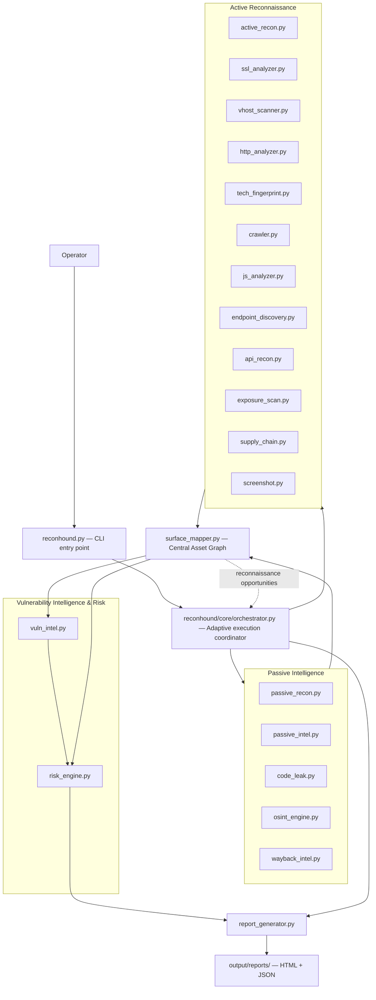

# ReconHound

**A modular Python reconnaissance framework that turns fragmented recon output into one correlated, evidence-driven attack-surface model.**


> Authorized reconnaissance only. ReconHound performs no exploitation, no credential attacks, and no persistence — see [Security Boundary](#security-boundary).

---

## Table of Contents

- [What Is ReconHound?](#what-is-reconhound)
- [Why It Exists](#why-it-exists)
- [Core Differentiators](#core-differentiators)
- [Architecture](#architecture)
- [The Four Phases](#the-four-phases)
- [Module Reference](#module-reference)
- [Surface Mapper — The Correlation Layer](#surface-mapper--the-correlation-layer)
- [Risk Engine — Relationship-Based Prioritization](#risk-engine--relationship-based-prioritization)
- [Security Boundary](#security-boundary)
- [Operator Workflow](#operator-workflow)
- [Terminal Experience](#terminal-experience)
- [Installation](#installation)
- [Usage](#usage)
- [Outputs & Reporting](#outputs--reporting)
- [Design Philosophy](#design-philosophy)
- [Limitations](#limitations)
- [Contributing](#contributing)
- [Security Reporting](#security-reporting)
- [License](#license)
- [Disclaimer](#disclaimer)

---

## What Is ReconHound?

ReconHound is a CLI reconnaissance framework for authorized attack-surface discovery. It is **not** a wrapper that runs a pile of scanners and concatenates their output. Its architectural value is the pipeline that sits between "a tool produced a result" and "an operator has something worth investigating":

```
Discover → Normalize → Correlate → Store Evidence → Update Asset Graph
   → Identify New Attack Surface → Make an Explainable Decision
   → Investigate Further → Prioritize → Report
```

Twenty-three modules feed observations into a central asset graph (`surface_mapper.py`), which deduplicates them, tracks evidence and confidence, preserves conflicting signals instead of discarding them, and exposes new reconnaissance opportunities that the orchestrator can act on automatically. A relationship-aware risk engine then turns that graph into a prioritized, explained investigation queue — not a flat list of alerts.

## Why It Exists

Running `subfinder`, `nmap`, `httpx`, `gau`, and a dozen other tools by hand produces a pile of disconnected text files. Nothing tells you that the subdomain `nmap` found is the same host `httpx` fingerprinted, or that a JS file `crawler` pulled down references an API endpoint that also showed up in Wayback history. Correlating that by hand doesn't scale past a handful of hosts.

```
Tool A ──┐
Tool B ──┤
Tool C ──┤──▶ Separate, uncorrelated output files
Tool D ──┤
Tool E ──┘
```

ReconHound instead runs the same category of checks, but every result flows through one graph:

```
Target
  │
  ▼
Passive Intelligence
  │
  ▼
Active Reconnaissance
  │
  ▼
Surface Mapping & Correlation
  │
  ▼
Vulnerability Intelligence
  │
  ▼
Risk Prioritization
  │
  ▼
Investigation
  │
  ▼
Structured Output / Reports
```

## Core Differentiators

| Concept | What it means in ReconHound |
|---|---|
| **Correlation** | Independent observations from different modules that describe the same underlying asset are merged, not duplicated. |
| **Evidence** | Every finding carries its evidence list, producing module, and timestamp — never just a bare conclusion. |
| **Confidence** | Findings are LOW / MEDIUM / HIGH, not binary. Converging independent signals raise confidence; a single weak signal stays LOW. |
| **Negative-Result Memory** | Completed checks are remembered per (asset, check) so they are not repeated unnecessarily. |
| **Conflict Preservation** | When modules disagree (e.g. two different version fingerprints for the same service), both observations are preserved and surfaced — never silently overwritten. |
| **Adaptive Discovery** | New discoveries (a cert SAN, a JS-referenced API route) can trigger the orchestrator to schedule relevant follow-up modules automatically. |
| **Prioritization** | The operator gets a ranked, explained investigation queue, not an undifferentiated data dump. |
| **Modular Architecture** | Each of the 23 modules is independently importable and testable; none imports another directly. |
| **Human-in-the-Loop** | ReconHound assists judgment — it does not replace manual validation or exploitation decisions. |

## Architecture



Orchestration is implemented at `reconhound/core/orchestrator.py`, not `reconhound/orchestrator.py`. `surface_mapper.py` is not a pipeline stage that runs once — it ingests output after **every** module invocation, so a crash at any point leaves behind a fully correlated graph of everything discovered up to that moment.

## The Four Phases

| Phase | Purpose | Input | Output |
|---|---|---|---|
| **Passive Intelligence** | Gather intel without touching the target directly (DNS, WHOIS, TLS cert transparency, public repos, OSINT, historical web archives). | Target domain | Observations → asset graph |
| **Active Reconnaissance** | Interact directly with the target: network scanning, HTTP/TLS analysis, endpoint/API/vhost discovery, crawling, JS analysis, exposure checks, screenshots. | In-scope hosts/IPs from the graph | Observations → asset graph |
| **Vulnerability Intelligence & Risk** | Map fingerprinted technology versions to known CVEs and score the correlated graph by relationship, not by isolated finding. | Correlated asset graph | Investigation queue with explanations |
| **Reporting / Structured Output** | Render the graph, assessment, and execution record as operator-readable and machine-readable artifacts. | Graph + assessment + execution record | HTML report, JSON report |

The CLI groups modules into finer-grained internal phases (`passive`, `active_network`, `active_web`, `intelligence`) that map onto this four-phase model.

## Module Reference

All 23 architectural modules are implemented in the repository, each independently importable and covered by its own test file under `tests/` (2,227 tests pass at the time of writing, run via `pytest`).

| Module | Phase | Purpose | Intelligence Produced |
|---|---|---|---|
| `passive_recon.py` | Passive | Initial infrastructure intel | DNS records, WHOIS, TLS certs + SAN extraction, ASN/IP-range data, email security posture (SPF/DMARC/DKIM) |
| `passive_intel.py` | Passive | External intel databases | Shodan / Censys host, port, banner, and cert data (requires API credentials) |
| `code_leak.py` | Passive | Public repository intel | Exposed keys/tokens, internal URLs, config files, DB connection strings found via GitHub code search |
| `osint_engine.py` | Passive | OSINT / digital footprint | Harvested emails, inferred naming conventions, HIBP breach correlation, DNS history, ASN neighbor analysis |
| `wayback_intel.py` | Passive | Historical web intel | Historical URLs/endpoints/parameters from the Wayback Machine, diffed against the current surface |
| `active_recon.py` | Active — network | Network-level recon | TCP/UDP port scans, banner grabs, protocol-specific enumeration (SMTP/SNMP/FTP/SSH/IPMI/DB), OS fingerprinting |
| `ssl_analyzer.py` | Active — network | TLS/certificate intel | Cert validity, TLS version, cipher suites, SAN extraction, self-signed/chain analysis |
| `vhost_scanner.py` | Active — network | Virtual-host discovery | Host-header-based hidden application discovery on already-discovered IPs |
| `http_analyzer.py` | Active — web | HTTP security posture | Security headers, cookie flags, CORS behavior, auth surfaces, JWT structure, redirect chains |
| `tech_fingerprint.py` | Active — web | Technology identification | CMS/framework/server/WAF detection with evidence and confidence |
| `crawler.py` | Active — web | In-scope web crawling | URLs, forms (classified by purpose), parameters, JS references, WebSocket/GraphQL indicators |
| `js_analyzer.py` | Active — web | Client-side JS intelligence | API routes and endpoints extracted from JS, source-map parsing, secret-indicator flags |
| `endpoint_discovery.py` | Active — web | Web/API endpoint enumeration | Directory/file/API endpoint discovery, full parameter inventory |
| `api_recon.py` | Active — web | Dedicated API recon | API version discovery, OpenAPI/Swagger and GraphQL detection, auth-method fingerprinting |
| `exposure_scan.py` | Active — web | Sensitive exposure detection | Exposed `.git`/`.env`/backups, cloud storage misconfigurations, verbose error-page intel |
| `supply_chain.py` | Active — web | Third-party dependency mapping | External JS/CDN/analytics inventory, CSP analysis, third-party trust categorization |
| `screenshot.py` | Active — web | Visual asset triage | Screenshots of discovered web interfaces organized by subdomain (requires a local headless Chromium/Chrome) |
| `vuln_intel.py` | Intelligence | Technology-to-CVE mapping | Possible CVE matches for fingerprinted versions — labeled as intelligence, never as confirmed exploitability |
| `risk_engine.py` | Intelligence | Relationship-based prioritization | CRITICAL/HIGH/MEDIUM/LOW/INFO investigation queue with an explanation per score |
| `report_generator.py` | Output | Professional reporting | HTML report + machine-readable JSON, rendered from the graph, assessment, and execution record |
| `core/orchestrator.py` | Core | Adaptive execution coordination | Phase sequencing, decision queue, adaptive-discovery rounds, per-module failure isolation |
| `reconhound.py` | Entry point | CLI | Argument parsing, live progress rendering, run summary, exit-code selection |

## Surface Mapper — The Correlation Layer

`surface_mapper.py` is ReconHound's central intelligence layer and the architectural brain of the system — it is not an afterthought bolted on at the end of the pipeline.

> Recon modules discover observations. Surface Mapper turns those observations into a coherent attack-surface model.

It consumes every module's structured finding records — `{type, target, value, evidence, confidence, source, timestamp, metadata}` — and turns them into:

```
Observation → Evidence → Asset / Relationship → Confidence → State
  → Reconnaissance Opportunity
```

Responsibilities implemented here:

- **Normalization & deduplication** of outputs from every module into a common asset schema.
- **The unified asset graph**, spanning organization → domain → subdomain → IP → port → service → technology → URL → endpoint → parameter → JavaScript → API → finding, plus DNS, WHOIS, ASN, TLS/SAN, Wayback, and third-party relationship data.
- **Evidence and provenance storage** for every asset and relationship.
- **Confidence tracking** (LOW / MEDIUM / HIGH) per finding.
- **Conflict detection and preservation** — contradictory observations are kept and surfaced, never silently resolved by picking one.
- **Negative-result memory** across four check states: not checked / checked and not found / found / found with uncertainty — so expensive checks are not repeated needlessly.
- **Scope enforcement** — reconnaissance opportunities are never emitted for assets outside the authorized target scope.
- **Discovery state tracking** (discovered / queued / investigated / completed / failed) and **attack-surface path construction** showing how each asset was reached.
- **Crash-safe, idempotent persistence** to `<output_dir>/surface_graph.json` — every state change is a content-hashed, atomic write, so re-ingesting the same finding twice is a no-op.
- **Exposing reconnaissance opportunities** that `core/orchestrator.py` consumes to drive adaptive discovery.

Surface Mapper is explicitly **not** a vulnerability scanner and does not exploit anything it correlates.

## Risk Engine — Relationship-Based Prioritization

`risk_engine.py` evaluates evidence other modules already produced. It never scans, probes, or executes anything itself. Its pipeline runs in five stages:

```
Ingestion → Signal Extraction → Classification → Correlation → Prioritization / Output
```

- **Ingestion** — reads the correlated asset graph (`surface_graph.json`, or a live in-memory graph) and its relationships.
- **Signal extraction** — normalizes graph content into discrete risk signals.
- **Classification** — scores each signal CRITICAL / HIGH / MEDIUM / LOW / INFO.
- **Correlation** — several MEDIUM/LOW signals converging on one asset (e.g. missing HSTS + a self-signed certificate + outdated TLS) can combine into a higher severity than any signal alone would justify.
- **Prioritization / output** — produces a ranked investigation queue where every entry carries a `rationale` explaining *why* it was scored the way it was.

> **Severity is a prioritization assessment of where to look first — never proof of exploitability.**

Vulnerability intelligence (from `vuln_intel.py`) is treated as one input signal among several, and CVE matches are always presented as "detected version *may* be affected by CVE-XXXX," never as confirmed vulnerabilities.

## Security Boundary

**ReconHound is:**
- Reconnaissance and attack-surface discovery
- Passive and active intelligence collection
- Cross-source correlation and evidence preservation
- Risk prioritization and investigation support

**ReconHound is not:**
- An exploitation framework
- A credential-attack or brute-force framework
- A privilege-escalation or persistence framework
- A replacement for manual security testing and human judgment

> **Authorized use only.** ReconHound performs active network interaction with the target you specify. Only run it against systems you own or have explicit, documented authorization to test. The operator is solely responsible for legal and ethical use.

## Operator Workflow

```
Authorized Target
       │
       ▼
   ReconHound
       │
       ▼
Attack-Surface Discovery  (passive + active recon)
       │
       ▼
Evidence + Relationships  (surface_mapper.py)
       │
       ▼
Risk Prioritization  (risk_engine.py)
       │
       ▼
Manual Validation  (operator reviews the investigation queue)
       │
       ▼
Deeper Security Testing  (outside ReconHound's scope)
```

ReconHound hands the operator a prioritized, evidence-backed starting point. It does not decide what is exploitable, and it does not perform the deeper testing itself.

## Terminal Experience

The CLI (`reconhound.py`) is built on [Rich](https://github.com/Textualize/rich) and renders:

- An ASCII banner with version, tagline, and the "authorized reconnaissance only" subtitle.
- An **Execution** panel showing the resolved target, mode, selected modules, output directory, and effective threads/timeout/min-severity settings before any network activity starts.
- Live per-module progress (phase headings, module → subject, and a completion glyph/status per module run) via a transient spinner.
- A **Run result** panel (status, elapsed time, module execution counts).
- A **Module execution** table aggregating runs, observations ingested, time spent, and outcome per module.
- A **Warnings and failures** panel for any failed or scope-rejected module runs.
- An **Attack surface** table (asset counts by type, plus totals for relationships, conflicts preserved, negative results, and pending opportunities).
- A **Risk prioritization** panel with severity counts and a ranked **Investigation queue** table, each row explaining why it was ranked there.
- An **Adaptive discovery** panel summarizing follow-up actions fired and any opportunities flagged for manual review.
- A **Decision queue** table (with `--verbose`) showing every significant orchestrator action and its recorded justification.
- An **Output artifacts** table listing every artifact actually written, with absolute paths and file sizes — an artifact that was not produced is labeled "not produced by this run," never omitted or faked.

Terminal output degrades gracefully: it falls back to ASCII glyphs on non-Unicode terminals, honors `--no-color`/`NO_COLOR`, and `--quiet` suppresses the banner and live progress while still printing the final summary.

## Installation

**Requirements:** Python 3.10+ (developed and tested against 3.13). Screenshot capture (`screenshot.py`) additionally requires a headless-capable Chromium or Chrome binary on the host (e.g. `/usr/bin/chromium` on Kali) — it is invoked via `subprocess`, not a Python dependency.

```bash
git clone <repository-url>
cd ReconHound

python3 -m venv .venv
source .venv/bin/activate

pip install -r requirements.txt
```

`requirements.txt`:

```
dnspython>=2.6,<3
python-whois>=0.9,<1
cryptography>=42
requests>=2.31,<3
beautifulsoup4>=4.12,<5
rich>=13,<15
```

No package is installed system-wide; there is no `setup.py`/`pyproject.toml` console-script entry point yet. Run the CLI as a module from the repository root:

```bash
python3 -m reconhound.reconhound --target example.com --full-scan
```

### Optional API credentials

Several passive-intelligence modules enrich their results with third-party APIs and degrade gracefully (skipping that data source with a clear message) when the corresponding credential is absent:

| Environment variable | Used by | Purpose |
|---|---|---|
| `SHODAN_API_KEY` | `passive_intel.py` | Shodan host/service/banner data |
| `CENSYS_API_ID` / `CENSYS_API_SECRET` | `passive_intel.py` | Censys host/service data |
| `GITHUB_TOKEN` | `code_leak.py`, `vuln_intel.py` | GitHub code search / higher API rate limits |
| `GOOGLE_API_KEY` | `osint_engine.py` | Google-based OSINT queries |
| `HIBP_API_KEY` | `osint_engine.py` | Have I Been Pwned breach correlation |
| `SECURITYTRAILS_API_KEY` | `osint_engine.py` | SecurityTrails DNS history |
| `HACKERTARGET_API_KEY` | `osint_engine.py` | HackerTarget reverse-IP intel |
| `NVD_API_KEY` | `vuln_intel.py` | Higher-rate NVD CVE lookups |

None of these are required for a scan to run.

## Usage

```bash
reconhound --target example.com --full-scan
```

(Substitute `python3 -m reconhound.reconhound` for `reconhound` if it is not installed on `PATH`.)

### Execution modes

```bash
reconhound --target example.com --full-scan       # passive + active + intelligence (default)
reconhound --target example.com --passive-only     # never touches the target directly
reconhound --target example.com --active-only      # active recon + intelligence modules
reconhound --target example.com --module js_analyzer   # run a single named module (repeatable)
```

### Common flags

| Flag | Effect |
|---|---|
| `-t, --target DOMAIN` | Authorized target domain (bare domain, not a URL or IP) — **required** |
| `-o, --output-dir DIR` | Directory for run state and artifacts (default: `output`) |
| `-m, --module NAME` | Run only the named module; repeatable |
| `--no-adaptive` | Disable acting on surface_mapper's reconnaissance opportunities |
| `--no-screenshots` | Exclude `screenshot.py` (skip the headless-browser dependency) |
| `--threads N` | Worker threads per module (default: 10) |
| `--timeout SECONDS` | Per-request network timeout (default: 8.0) |
| `--wordlists-dir DIR` | Override the bundled `wordlists/` directory |
| `--min-severity LEVEL` | Lowest severity admitted to the investigation queue (default: LOW) |
| `--top N` | Investigation-queue rows shown in the terminal summary (default: 10) |
| `-v, --verbose` | Show per-module detail, the decision queue, and every recorded error |
| `-q, --quiet` | Suppress the banner and live progress; print only the final summary |
| `--debug` | Print full tracebacks on unexpected failures |
| `--no-color` | Disable color/styling |
| `-V, --version` | Print the version and exit |

Full reference: `reconhound --help`.

### Examples

```bash
# Full pipeline against an authorized target, default settings
reconhound --target example.com --full-scan

# Passive-only recon — no active network interaction with the target
reconhound --target example.com --passive-only

# Run just the JS analyzer module standalone
reconhound --target example.com --module js_analyzer

# Custom output location, higher concurrency, longer timeout
reconhound --target example.com --output-dir /reports/example --threads 10 --timeout 30

# Full scan without screenshot capture, quiet terminal output
reconhound --target example.com --full-scan --no-screenshots --quiet
```

### Exit codes

| Code | Meaning |
|---|---|
| `0` | Run completed (discovering nothing is a normal outcome) |
| `1` | Run completed, but one or more modules or stages failed |
| `2` | Invalid arguments, invalid target, or invalid configuration |
| `3` | Fatal error — the run could not start or aborted |
| `130` | Interrupted with Ctrl+C — everything discovered so far was preserved |

## Outputs & Reporting

Every run writes its state incrementally to `<output-dir>` (default `output/`):

| Artifact | File | Written by |
|---|---|---|
| Raw discoveries | `pending_assets.json` | Each producer module, immediately on discovery |
| Correlated asset graph | `surface_graph.json` | `surface_mapper.py` |
| Risk assessment | `risk_assessment.json` | `risk_engine.py` |
| Execution record + decision queue | `orchestrator_run.json` | `core/orchestrator.py` |
| Screenshots | `screenshots/<subdomain>/...png` | `screenshot.py` |
| HTML report | `reports/reconhound_report.html` | `report_generator.py` |
| JSON report | `reports/reconhound_report.json` | `report_generator.py` |

`report_generator.py` reads the graph, the risk assessment, and the execution record — it computes no severity or confidence of its own, only renders what those modules already produced. The HTML report includes an executive summary, asset inventory, technology stack, attack-surface paths (reconstructed via `surface_mapper.py`'s own path logic), the risk-ranked investigation queue with evidence, a supply-chain/third-party map, a vulnerability-intelligence section, and a raw-data appendix. Every value rendered into HTML is escaped, the report loads no external resources or scripts, and it carries a restrictive Content-Security-Policy meta tag.

Where an input (graph, assessment, or execution record) is missing or a section could not be built, the report states that explicitly rather than showing an empty or zeroed-out section.

## Design Philosophy

- **Evidence over assumptions** — every finding traces back to its supporting evidence and producing module.
- **Correlation over isolated findings** — the asset graph, not per-module output, is the source of truth.
- **Explicit confidence** — nothing is presented as certain when it isn't.
- **Negative-result memory** — completed checks are remembered, not repeated.
- **Conflict preservation** — disagreements between modules are surfaced, not resolved silently.
- **Strict scope awareness** — active modules only ever run against assets the graph marked in-scope.
- **Passive/active separation** — `--passive-only` never touches the target directly.
- **Intelligence/exploitation separation** — vulnerability intelligence is never promoted to confirmed exploitability.
- **Modularity** — every module is independently importable and testable; none imports another sibling module.
- **Adaptive discovery** — new findings can trigger relevant follow-up modules automatically, within a bounded budget.
- **Decision transparency** — every significant orchestrator action is logged with its reason.
- **Human-driven investigation** — the operator validates and decides; ReconHound informs that decision.

## Limitations

- **No exploitation or confirmation of exploitability.** Vulnerability intelligence identifies *possible* CVE matches from fingerprinted versions; it never confirms exploitability, and nothing here validates a finding by attempting to exploit it.
- **Screenshot capture depends on a local browser binary.** `screenshot.py` requires a Chromium/Chrome executable on the host; without one, capture is reported as unavailable rather than failing the run.
- **Several passive modules require third-party API credentials** (Shodan, Censys, GitHub, HIBP, SecurityTrails, HackerTarget, NVD) to produce their full intelligence; without credentials, that data source is skipped with a clear message rather than blocking the run.
- **No installable package or console-script entry point yet.** The CLI is run as `python3 -m reconhound.reconhound` (or `python3 reconhound/reconhound.py`) from the repository root; there is no `pip install`-able distribution.
- **Producer modules run sequentially, not concurrently, across each other** — concurrency exists inside a module (e.g. a module's own thread pool for port scanning or crawling), not between modules, to keep the shared `pending_assets.json` write path safe and the run deterministic.
- **The `plugins/` extensibility layer described in the architecture is not implemented in this repository.**
- **No GUI or web dashboard.** ReconHound is CLI-only by design.

## Contributing

This repository does not currently define a formal contribution process (no `CONTRIBUTING.md`, issue templates, or CI pipeline). If you are working in this codebase:

- Read `context.md` before making any substantive change — it is the authoritative architectural reference.
- Follow the working rules in `CLAUDE.md`: implement one module at a time, preserve the evidence/confidence/correlation model, and do not redesign the architecture without raising the change and getting approval first.
- Each module has a corresponding test file under `tests/`; add or update tests alongside any behavioral change.
- Run the full suite with `pytest` from the repository root before submitting a change.

## Security Reporting

There is no dedicated security-disclosure contact or policy file in this repository at this time. If you discover a security issue in ReconHound itself (as opposed to findings ReconHound produces about a target you scanned), please open an issue via the repository's issue tracker and avoid including details of any live target in the report.

## License

No license file is currently included in this repository. Until one is added, all rights are reserved by the author, and no reuse, distribution, or modification rights are implied.

## Disclaimer

ReconHound is provided for authorized security testing, research, and defensive security work only. Active reconnaissance interacts directly with the systems you point it at. You are responsible for obtaining explicit, documented authorization before running ReconHound against any target, and for complying with all applicable laws and agreements. The authors accept no liability for misuse or for any damage resulting from use of this tool.
